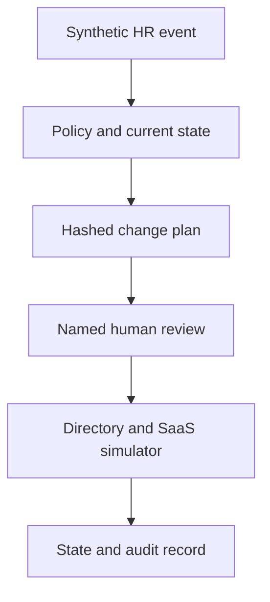

# AI Assisted IAM Lifecycle Automation Lab

An end to end **personal portfolio project** showing how synthetic HR events drive joiner, mover, and leaver changes in a simulated directory and SaaS application. The workflow builds a plan, requires a named human review, applies only the approved plan to local state, and records an auditable sequence. An optional AI assistant can draft a verification note, but cannot change the plan or approve access.

This is a lab, not an employer project or a production identity integration. All identities and entitlements in the demo are fictional.

## Run in two commands

Python 3.11 or later is recommended. Offline simulation and tests use only the standard library.

```bash
python3 jml_lab.py demo
python3 jml_lab.py verify-audit
```

The demo writes `output/demo/`, including each event plan, review, state transition, a final state, and `audit.jsonl`. It refuses to overwrite an existing output directory. To rerun, pass a different directory, for example `python3 jml_lab.py demo --output output/second_run`. Sample outputs are included in `examples/` so a reviewer can inspect the workflow without running it.

```bash
python3 -m unittest discover -s tests -v
```

## What happens

| HR event | Directory simulation | SaaS simulation | Approval gate |
| --- | --- | --- | --- |
| Joiner in Finance | Create an enabled identity and assign baseline and Finance groups. | Create an active account with baseline and invoice access. | The approver validates the source event and target mapping. |
| Mover to Operations | Remove Finance group, set department, then add Operations group. | Revoke invoice role before granting case editor role. | A new approval is tied to the exact state and plan. |
| Leaver | Disable the identity and remove its groups. | Deactivate the account and revoke its roles. | The leaver event has its own review and audit trail. |

The policy in `sample_data/policy.json` defines the groups and SaaS roles. `sample_data/hr_events.json` contains the three synthetic events. `sample_data/decisions.json` contains the demonstration reviewer decisions. The lab uses a baseline access role to show that a mover retains access common to both departments.



## Approval and audit design

`plan()` binds actions to the HR event, policy hash, and source state hash. `apply()` recomputes the plan, checks the approval for the same plan hash, requires an authorized demo reviewer distinct from the executor, and rejects a changed, stale, or replayed event. A rejection blocks all state changes. Each approved action is added to a SHA256 hash chained JSONL audit log. The `verify-audit` command detects an edited event unless the entire chain is recomputed.

**Important boundary:** Reviewer names in a local JSON file are illustrative, not real authentication. The log is neither signed nor externally anchored. The simulator does not implement transaction recovery, session revocation, password controls, error retries, reconciliation, or a production approval service. A real deployment needs an authenticated workflow, scoped credentials, protected audit storage, exception handling, rollback design, reconciliation, tenant specific access policy, privacy review, and change control.

## Optional AI investigation note

The AI feature is a separate advisory command. It reads a synthetic plan and returns a verification step and a potential risk. It is not read by the approval or execution functions. The rule and policy engine alone selects actions.

```bash
export OPENAI_API_KEY="your-key"
export OPENAI_MODEL="a-model-available-to-your-account"
python3 ai_review_note.py --plan output/demo/2_mover_plan.json --output output/ai_mover_note.json
```

The request uses the Responses API with a strict JSON schema and `store: false`. It can incur API charges. Do not put a key in source files or send real identity records to a model without organizational approval. The AI path was tested with a mocked response; a live model request was not made while preparing this project.

## Optional Microsoft Graph check in a test tenant

`graph_readonly.py` implements a **real Microsoft Graph API request path**: it obtains an app only token from Microsoft identity platform and reads one specified test user from Microsoft Graph. It never creates, changes, disables, or deletes a Graph object. It is separate from the local simulator. The request flow was tested with mocked HTTP responses; no tenant credentials were available for a live run.

To exercise it, use a test tenant you control. Register an application there, grant the Microsoft Graph **User.Read.All application permission** with administrator consent, and create a test user. Set these variables locally:

```bash
export LAB_TENANT_ID="tenant-guid"
export LAB_TEST_TENANT_ID="same-tenant-guid"
export LAB_CLIENT_ID="app-guid"
export LAB_CLIENT_SECRET="test-app-secret"
export LAB_TEST_USER_ID="test-user-guid"
export LAB_ALLOWED_DOMAIN="your-test-domain.example"
python3 graph_readonly.py
```

The duplicate tenant variables form an explicit allowlist check. The returned user's ID and sign in domain must match the configured test user and domain. The utility reads only `id`, `userPrincipalName`, `accountEnabled`, and `department`. It does not enumerate a tenant. Its client secret approach is for a short lived lab only; a production application should use approved credential management and least privilege. Delete or rotate the test secret after use. Do not use an employer tenant without permission.

Microsoft documentation: [App only authentication](https://learn.microsoft.com/en-us/graph/auth-v2-service), [List and read user permissions](https://learn.microsoft.com/en-us/graph/api/user-list), and [Identity lifecycle workflows](https://learn.microsoft.com/en-us/graph/api/resources/identitygovernance-lifecycleworkflows-overview).

## Repository map

- `jml_lab.py`: deterministic lifecycle planner, reviewer gate, simulator, audit chain, and CLI.
- `graph_readonly.py`: optional, narrowly scoped Graph test tenant check.
- `ai_review_note.py`: optional advisory AI note.
- `sample_data/`: fictional HR events, initial state, policy, and demo reviewers.
- `examples/`: generated output for recruiters to inspect.
- `tests/`: end to end, denial, replay, plan tamper, audit tamper, Graph mock, and AI boundary tests.
- `.github/workflows/tests.yml`: runs the test suite and demo on each GitHub push and pull request.
- `LINKEDIN_PROJECT.md`: a truthful profile entry and interview walkthrough.
